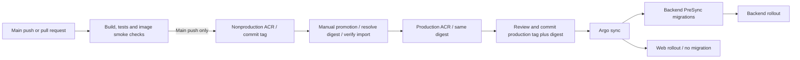

# cronus-gitops

Kubernetes deployments for Cronus, a cloud-native food-ordering application. Argo CD reconciles
application charts, environment foundations and Gateway routes from Git. Production and nonproduction
use separate control planes while sharing Helm charts.

## Deployment & GitOps

- Separate Argo installations and deployment boundaries for production, dev and staging.
- Git selects the deployed images and records release changes.
- Application CI publishes to nonproduction; manual promotion copies an image digest into production.
- Backend migrations run before rollout under separate schema-changing identities.
- Gateway routing, ingress policies and health checks support application deployment.

## Technology stack

Kubernetes, Argo CD, Helm, GitHub Actions and Azure Container Registry.

## Delivery workflow



Application CI runs in the web and service repositories. Promotion makes an image available; a GitOps
values change selects the release. Restore a reviewed production tag/digest pair for an application
rollback, checking schema compatibility because image rollback does not reverse database migrations.

## Quick start

Provision [cronus-infrastructure](https://github.com/hashirsarwar/cronus-infrastructure) and complete its
database grants. Configure environment identities and images, then use the appropriate Argo installer:
[nonproduction](bootstrap/nonprod/install.sh) or [production](bootstrap/prod/install.sh).

Use a separate read-only repository deploy key for each cluster and keep private keys outside Git.
Nonproduction requires an authorized API connection and the correct kubectl context; production
installation requires Azure run-command permissions for its private cluster. Bootstrap changes are
operator-applied rather than reconciled by Argo.

Inspect a chart locally with Helm:

```bash
helm lint charts/cronus-ordering-service -f charts/cronus-ordering-service/values-dev.yaml
```

Verify image availability and workload health in the intended environment. The public Gateways serve
HTTP; sensitive customer traffic requires verified HTTPS.

## Related repositories

| Repository | Responsibility |
| --- | --- |
| [cronus-infrastructure](https://github.com/hashirsarwar/cronus-infrastructure) | Azure resources, managed identities and PostgreSQL privilege bootstrap. |
| [cronus-ordering-service](https://github.com/hashirsarwar/cronus-ordering-service) | Restaurant catalogue, cart rules, order persistence and delivery integration. |
| [cronus-delivery-service](https://github.com/hashirsarwar/cronus-delivery-service) | Idempotent delivery creation and lookup in its own database. |
| [cronus-web](https://github.com/hashirsarwar/cronus-web) | Restaurant-to-order browser journey and runtime-configured telemetry. |
